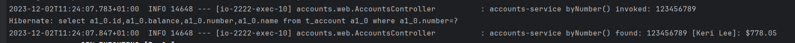
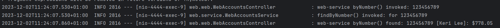
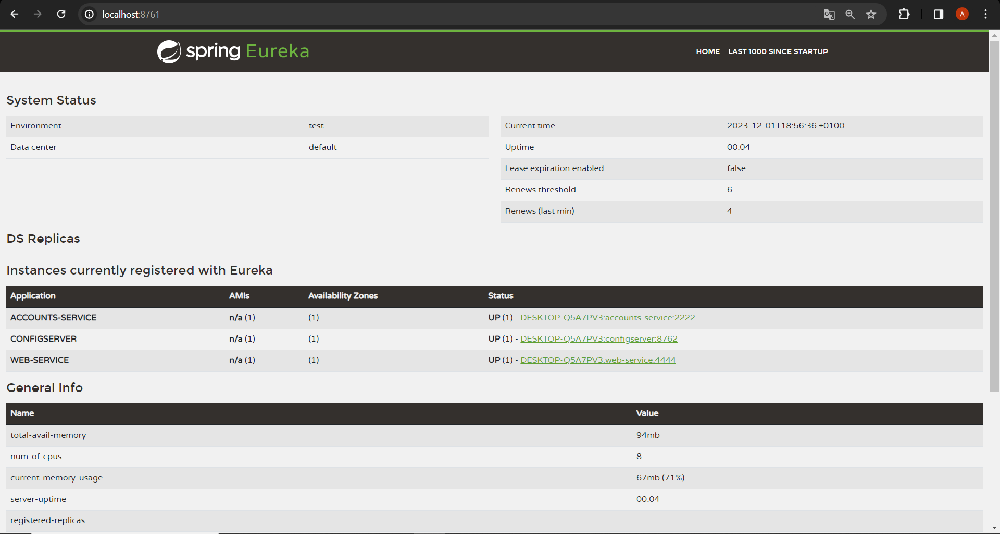
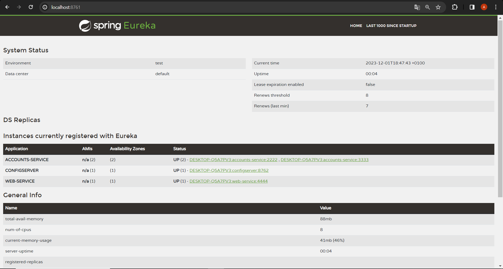
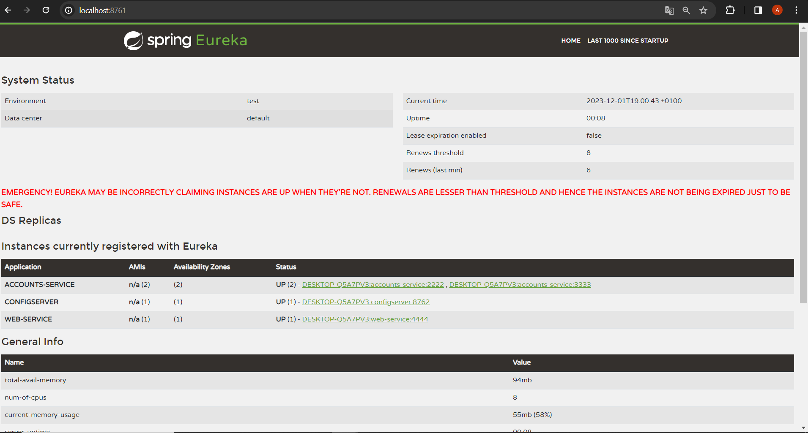
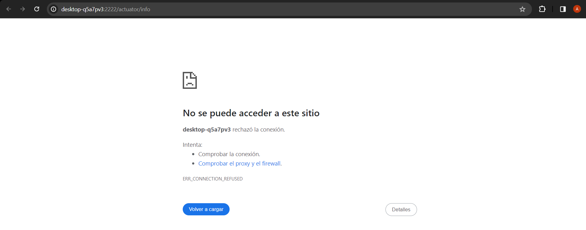
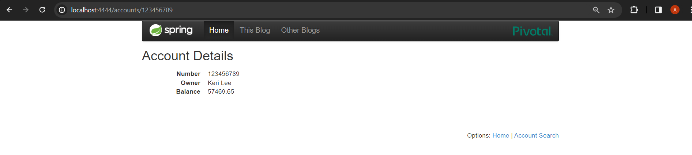

# Configuration for Lab 6

### 0. Link to my service configuration repository.
https://github.com/ALalagunaa/lab6-microservices-config-repo.git

### 1. Two services `accounts (2222)` and `web` are running and registered (two terminals). **2 Log screenshot**.
Para que funcionen ambos servicios, con el accounts en el 2222 hay que modificar ambos ficheros de configuración. En el **accounts-service.yml** modificamos el *server port* para que tenga el 2222. Tanto en el **accounts-service.yml** como en el **web-service.yml** añadimos las siguientes líneas:
```yaml
cloud:
    config:
      uri: http://localhost:8888
      name: accounts-service
      profile: default
```
Para el fichero **web-service.yml** el *name* será *web-service*

Desde la página *localhost:4444*, correspondiente al web service, hacemos un ping al servicio accounts y observamos los logs de la terminal de ambos servicios.

El log de la terminal del servicio accounts es el siguiente:


El log de la terminal del servicio web es el siguiente:



### 2. The service registration service has these two services registered (a third terminal). **Eureka dashboard screenshot**.
Cuando tenemos ambos servicios registrados, la página de Eureka resultante es la siguiente:


### 3. Update the configuration repository so that the `accounts` service uses now the port 3333. **Link to the commit**.
Para que el servicio *accounts* use ahora el puerto 3333 simplemente tenemos que cambiar el *port* del fichero de configuración correspondiente.
El commit en el cual se hace esto está en el siguiente link: https://github.com/ALalagunaa/lab6-microservices-config-repo/commit/882bdb8b03110f9bdf396d88d1015a7832987059

*(hay más commits en los cuales se modifica este puerto pero ha sido por distintas pruebas/errores que he ido haciendo/teniendo al realizarlo)*

### 4. Run a second instance of the `accounts` service using the new configuration (a fourth terminals). What happens? **Explain and Eureka dashboard screenshot**
Se demuestra como podemos lanzar un segundo service accounts en otro puerto sin tener que detener la ejecución anterior



### 5. What happens when you kill the service `accounts (2222)` and do requests to `web`?. **Explain and screenshots, including at least one Eureka dashboard screenshot** 
Al matar el proceso del servicio *accounts* en el puerto 2222 deja de estar accesible, dejando de ser visible en la página de Eureka. *(en mi caso, sigue apareciendo ya que no se está actualizando correctamente y por eso aparece también el mensaje en la pantalla)*



Para comprobar que este servicio deja de ser accesible en el puerto 2222 he probado a conectarme a él, obteniendo el siguiente mensaje de error:

 


### 6. Can the web service provide information about the accounts again?. Why? **Explain and screenshots, including at least one Eureka dashboard screenshot** 
El servidor ahora podrá devolver información de la segunda instancia del servicio accounts lanzado en el puerto 3333 como se puedo observar en la siguiente imagen:



